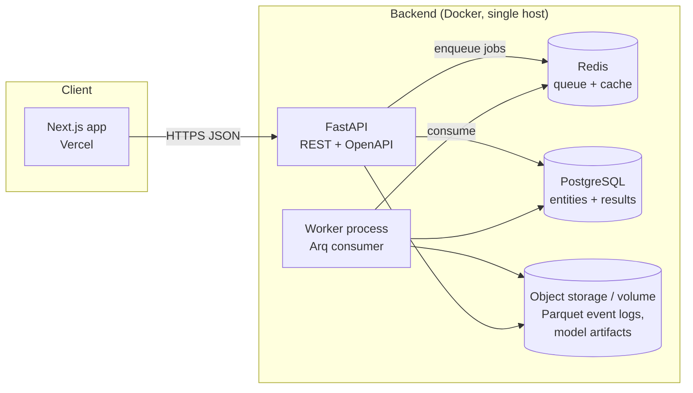

# System Architecture — Restart Lab

**Version:** 0.1 · **Status:** Design review draft

---

## 1. Architecture style: modular monolith + worker

A **modular monolith**: one Python codebase with strictly enforced internal boundaries, deployed
as two processes (API, worker), plus a separately deployed Next.js frontend.

**Challenged assumption:** a "professional platform" needs microservices. Rejected. Microservices
for a solo 12-week build buy operational pain and demo fragility for zero portfolio credit —
interviewers are *more* impressed by a monolith with clean internal boundaries and an articulated
"here is the seam where the sim engine would be extracted into a service" story than by a fragile
distributed system. The seams are designed in (the sim core is a pure library with zero web/DB
imports), so extraction later is mechanical.



## 2. Codebase layout (Clean Architecture, dependency rule enforced)

*(As built in Phase 0; revised from the original sketch — the simulation core was promoted to a
standalone installable package under `packages/`, which makes the dependency rule a packaging
fact rather than a convention.)*

```
restart-lab/
├── apps/
│   ├── backend/              # FastAPI app (restart_api): routers, DTOs, settings — web adapter
│   │   ├── src/restart_api/  #   depends on restart-simulation-core via uv workspace
│   │   └── tests/
│   └── frontend/             # Next.js 16 + TypeScript + Tailwind v4 (App Router, Turbopack)
├── packages/
│   ├── simulation-core/      # THE DOMAIN CORE (python pkg `restart`) — pure, no web/DB imports
│   │   ├── src/restart/      #   physics/ agents/ tactics/ montecarlo/ ml/ domain/ (phased in)
│   │   └── tests/
│   └── shared-types/         # TS mirrors of the API contract (pitch-kit joins in Phase 6)
├── data/                     # raw → staging → marts lake (git-ignored, rebuildable via ETL)
├── docs/                     # design package + living guides
├── infra/                    # docker-compose: Postgres 16 + Redis 7 (localhost-bound)
├── scripts/                  # verify.{sh,ps1} — full CI suite locally
├── tests/                    # cross-package integration tests
└── .github/workflows/        # CI: python + frontend jobs
```

Later phases add (per design): `etl/` and `worker/` as backend modules or sibling packages,
`notebooks/` for validation, and a `pitch-kit` TS package — each lands in the phase that
introduces its first real consumer.

**Dependency rule:** `restart/` (domain) imports nothing from `api/`, `storage/`, or `worker/`.
Adapters depend inward. Enforced in CI with `import-linter` contracts — a portfolio-visible
artifact of architectural discipline, not just a convention.

**Interface contracts (per Clean Architecture):**
- `restart.montecarlo.BatchRunner.run(scenario: Scenario, n: int, seed: int) -> BatchResult` —
  pure, deterministic, no I/O.
- `storage.repositories.*` implement protocols defined in `restart.domain.ports` (e.g.
  `ScenarioRepository`, `ResultStore`), so the domain is testable with in-memory fakes.
- `api` translates pydantic DTOs ⇄ domain objects at the boundary; domain types never leak
  raw into JSON.

## 3. Technology choices and justification

| Layer | Choice | Justification | Alternatives considered |
|---|---|---|---|
| Sim core numerics | **NumPy (vectorized batch) + Numba for hot loops** | 100k-run requirement (PRD FR-4.1) demands batch vectorization; Numba rescues any unavoidable per-tick Python | JAX (rejected v1: Windows dev friction, overkill without gradients; revisit if differentiable sim becomes a goal), C++/Rust core (rejected: cost/benefit for solo build) |
| API | **FastAPI + pydantic v2** | Async, OpenAPI for free, pydantic doubles as validation layer (security req) | Flask (weaker typing story), Django (ORM/admin unneeded) |
| Job queue | **Arq on Redis** | Async-native, tiny API, fits FastAPI; jobs are coarse (one batch = one job) | Celery (heavier, config sprawl), RQ (sync), Postgres-as-queue via SKIP LOCKED (viable fallback — fewer moving parts; rejected to keep Redis for caching anyway) |
| Primary DB | **PostgreSQL 16** | Relational entities + JSONB for Routine Specs; mature, free tiers everywhere | SQLite (insufficient for concurrent worker+API writes), Mongo (no) |
| Bulk results | **Parquet files (volume or S3-compatible)** | 100k × per-sim event rows do not belong in Postgres; Parquet + DuckDB gives fast analytical reads | Postgres rows (write amplification, bloat), ClickHouse (operational overkill) |
| Analytics-on-files | **DuckDB** | Query Parquet event logs in-process for dashboard aggregates; zero infra | Spark (absurd at this scale) |
| ML | **scikit-learn, XGBoost, LightGBM, Optuna, cmaes, SHAP** | See ML Architecture doc | PyTorch (only if Tier-3 RL happens) |
| Experiment tracking | **MLflow (local file backend)** | Standard, lightweight, screenshots well | W&B (external account dependency for reviewers) |
| Frontend | **Next.js 16 (App Router) + TypeScript + Tailwind** | Industry default; SSR for report pages; Vercel deploy | Vite SPA (loses easy server rendering of reports) |
| 2D pitch / replay | **Custom SVG components + Canvas for replay** | Full control over the core differentiating visuals | d3-only (fights React), Pixi (heavier than needed) |
| Charts | **visx** | D3 power with React idioms; consultancy-grade control over styling | Plotly (styling ceiling → "generic dashboard" look), Recharts (too rigid) |
| 3D (Tier 2) | **React Three Fiber + drei** | Standard React 3D; shares replay data format with 2D player | Three.js raw (more code), deck.gl (geo-oriented, wrong tool — rejected) |
| Infra | **Docker Compose (dev); GitHub Actions (CI); Vercel (web) + Railway or Fly.io (api/worker/pg/redis)** | Live demo with background workers needs a long-running container host; Vercel serves the frontend it's best at | All-on-Vercel (rejected for worker: long Monte Carlo jobs fit containers better than serverless functions, even with 300 s fluid-compute limits); AWS (overkill + cost risk for a portfolio demo) |

## 4. Key data flows

### 4.1 Run a simulation batch
1. UI posts `ScenarioSpec` → `POST /api/v1/sim-runs` (validated by pydantic; rate-limited).
2. API hashes the canonical spec (`scenario_hash`), persists a `sim_runs` row (`status=queued`),
   enqueues `run_batch(sim_run_id)`; returns `202` + run id. Duplicate spec+seed+engine-version
   ⇒ returns existing run (idempotency).
3. Worker loads scenario, executes vectorized batch in chunks (e.g. 2k sims/chunk), streams
   progress to Redis (`sim:progress:{id}`), writes per-sim event log to Parquet, aggregates KPIs
   + CIs into `sim_results_summary`, sets `status=complete`.
4. UI polls `GET /sim-runs/{id}` (or SSE later); renders distributions from summary; replay
   fetches individual sim trajectories (saved for a sampled subset — e.g. the median, best, worst,
   and 50 random sims — to bound storage).

### 4.2 Optimize a routine
1. `POST /api/v1/optimizations` with search-space config + budget.
2. Worker runs Optuna study; each trial = one (smaller, e.g. 500-sim) batch via the same
   BatchRunner; trials persisted to `optimization_trials` as they complete.
3. UI shows live convergence, parallel-coordinates of trials, and the top-k routines, each
   re-validated with a full 10k-sim run before being labeled "recommended."

### 4.3 Data ingestion (offline)
`etl` CLI: StatsBomb open data → raw JSON (cached) → typed staging Parquet → Postgres marts
(player profiles, set-piece event tables for xG training). See Data Pipeline doc.

## 5. API surface (v1 sketch)

```
GET    /api/v1/teams                      GET    /api/v1/players?team=
POST   /api/v1/players (custom)           GET    /api/v1/routines / POST
GET    /api/v1/defensive-schemes          POST   /api/v1/scenarios (validate+persist)
POST   /api/v1/sim-runs                   GET    /api/v1/sim-runs/{id}
GET    /api/v1/sim-runs/{id}/events?sample=replay
POST   /api/v1/optimizations              GET    /api/v1/optimizations/{id}
GET    /api/v1/optimizations/{id}/trials  GET    /api/v1/xg/models (cards)
POST   /api/v1/xg/score (ad-hoc shot scoring)
GET    /api/v1/reports/team/{team_id}     GET    /healthz, /readyz
```
Versioned under `/api/v1`; OpenAPI served at `/docs` (auth-free read, keyed writes).

## 6. Determinism & versioning (cross-cutting)

- **Engine version** is a first-class field on every result; physics changes bump it; results
  from different engine versions are never silently compared.
- **Seeds**: one root seed per run; per-sim child streams via `numpy.random.Philox` counters —
  parallel-safe and replayable.
- **Scenario hash**: canonical-JSON SHA-256 of the full spec; the cache/idempotency key.

## 7. Error handling strategy

- Domain raises typed exceptions (`InvalidRoutine`, `InfeasibleAssignment`,
  `CalibrationGateFailure`); API maps to RFC 9457 problem-details JSON.
- Worker jobs: max 2 retries on infra errors only (never on validation errors); failed runs keep
  `status=failed` + structured error payload, visible in UI.
- Sim-level: a sim that produces NaN/exploding states is counted, quarantined (inputs dumped to
  a debug artifact), and excluded — runs report `n_quarantined`; > 0.1% fails the batch.

## 8. Testing strategy

| Level | What | Examples |
|---|---|---|
| Unit | Physics functions, agent kinematics, spec validation | drag-only trajectory matches analytic solution; player cannot exceed top speed |
| Property | Invariants under random inputs (Hypothesis) | energy never increases after bounce; replay determinism: same seed ⇒ bit-identical events |
| Golden | Pinned trajectories/outcome distributions per engine version | corner delivery to (5.5, 34) lands within pinned tolerance |
| Integration | API ⇄ queue ⇄ worker ⇄ DB round trips (Compose in CI) | submit run → poll → summary persisted |
| Calibration | Statistical gates vs real base rates (Phase 3+) | simulated corner goal rate within pinned band |
| E2E | Playwright: build scenario → run → see results | the 3-minute reviewer journey, automated |

## 9. Security architecture & checklist

- [ ] All secrets via environment variables; `.env.example` committed, `.env` git-ignored;
      production secrets in platform secret stores (Vercel/Railway). No keys in code or docs.
- [ ] Pydantic validation on every request body/query; strict bounds on n_sims, budgets,
      coordinates (pitch bounds), array sizes — sim inputs are effectively code, treat them
      as hostile.
- [ ] Rate limiting (slowapi/Redis): per-IP on reads, stricter on compute-triggering POSTs;
      global concurrent-job cap so the demo can't be cost-bombed.
- [ ] Write endpoints require API key (hashed at rest); demo mode = read + bounded sim sizes.
- [ ] CORS allowlist (exact origins); security headers (CSP, HSTS) at the edge.
- [ ] Containers run non-root; minimal base images; `pip-audit` + `npm audit` + Dependabot in CI.
- [ ] No PII: public-figure athletic data only; provenance-tagged (licensing, not privacy, is
      the constraint — see Data Pipeline).
- [ ] Structured logging (no secrets in logs); request ids; basic anomaly alerting on job-queue
      depth and error rates.

## 10. Observability

Structured JSON logs (loguru/structlog); Prometheus-style `/metrics` (sims/sec, queue depth,
job durations) — even if only scraped locally, the instrumentation is a portfolio artifact;
Sentry free tier for both frontend and API **(reversible)**.

## Assumption index

- `S-1`: A single 2-vCPU host sustains demo load given precomputed canonical scenarios and the
  500 sims/sec/core budget (validated Phase 3; fallback: cap interactive runs at 1k and queue).
- `S-2`: Parquet-on-volume suffices for v1; S3-compatible store is a config swap
  (`storage.ResultStore` port), not a refactor.
