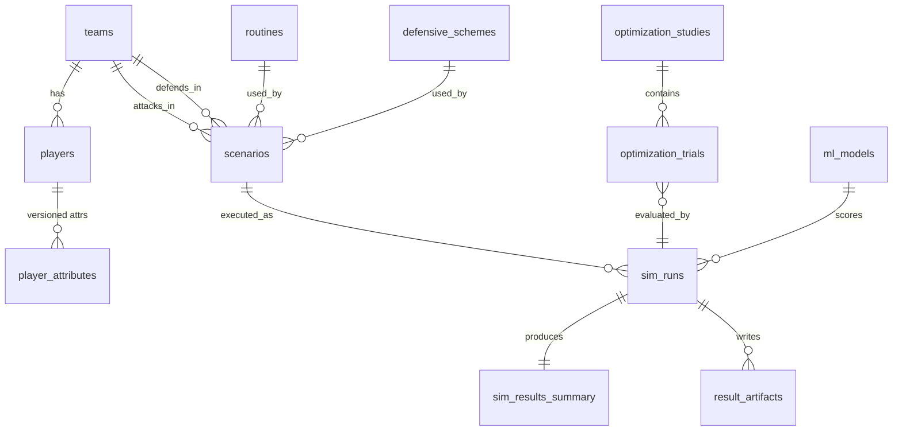

# Database Schema — Restart Lab

**Version:** 0.1 · **Status:** Design review draft
**Engine:** PostgreSQL 16 · **Migrations:** Alembic

---

## 1. Storage strategy (what lives where, and why)

| Data | Store | Rationale |
|---|---|---|
| Teams, players, attributes, routines, scenarios, run metadata, KPI summaries, optimization studies/trials, model registry | **Postgres** | Relational, queried by the app, small-to-medium volume |
| Per-simulation event logs (100k sims × ~5–30 events) and sampled full trajectories | **Parquet** (path referenced from Postgres) | Columnar, append-once, read analytically via DuckDB; keeps Postgres lean |
| Raw + staged source data (StatsBomb JSON, staging Parquet) | **Filesystem under `data/`**, not the app DB | ETL concern; reproducible from source; only marts land in Postgres |
| Model artifacts (pickled pipelines, SHAP explainers) | **Object storage/volume**, path + hash in Postgres `ml_models` | Artifacts are files; DB stores identity + metadata |

**Challenged assumption:** "simulation platform ⇒ all results in the database." Rejected:
storing 100k-run event logs as rows is the classic mistake here — write amplification, vacuum
pressure, and slow analytics. Postgres stores *identity and summaries*; bulk data is columnar.

## 2. Entity-relationship overview



## 3. DDL (core tables)

```sql
-- Identity convention: UUIDv7 PKs (time-ordered); created_at/updated_at on all tables (omitted
-- below for brevity); soft deletes NOT used (history is append-only via versioning instead).

CREATE TABLE teams (
    id            UUID PRIMARY KEY,
    fifa_code     TEXT NOT NULL UNIQUE,          -- 'ENG', 'FRA', 'USA'
    name          TEXT NOT NULL,
    confederation TEXT NOT NULL,                  -- 'UEFA', 'CONMEBOL', ...
    is_custom     BOOLEAN NOT NULL DEFAULT FALSE,
    wc2026_status TEXT NOT NULL DEFAULT 'qualified'  -- 'qualified'|'projected'|'custom'
);

CREATE TABLE players (
    id             UUID PRIMARY KEY,
    team_id        UUID NOT NULL REFERENCES teams(id),
    full_name      TEXT NOT NULL,
    display_name   TEXT NOT NULL,
    position_group TEXT NOT NULL CHECK (position_group IN ('GK','DF','MF','FW')),
    height_cm      NUMERIC(5,1),
    weight_kg      NUMERIC(5,1),
    preferred_foot TEXT CHECK (preferred_foot IN ('L','R','B')),
    is_custom      BOOLEAN NOT NULL DEFAULT FALSE
);

-- Attributes are VERSIONED and PROVENANCE-TAGGED: every value knows where it came from.
-- One row per (player, attribute_set version). The sim consumes exactly one active set.
CREATE TABLE player_attributes (
    id              UUID PRIMARY KEY,
    player_id       UUID NOT NULL REFERENCES players(id),
    version         INT  NOT NULL,
    is_active       BOOLEAN NOT NULL DEFAULT TRUE,
    -- capability envelope consumed by the agent model (units in comments = data dictionary src)
    top_speed_ms        NUMERIC(4,2) NOT NULL,   -- m/s, bounded [5.5, 9.8]
    accel_ms2           NUMERIC(4,2) NOT NULL,   -- m/s^2, bounded [2.0, 8.0]
    reaction_time_ms    INT          NOT NULL,   -- [150, 450]
    agility             NUMERIC(4,3) NOT NULL,   -- 0-1, scales turn-rate limit
    jump_reach_cm       NUMERIC(5,1) NOT NULL,   -- standing reach + jump, derived
    heading             NUMERIC(4,3) NOT NULL,   -- 0-1, contest + accuracy weight
    strength            NUMERIC(4,3) NOT NULL,   -- 0-1, duel weight
    marking             NUMERIC(4,3) NOT NULL,   -- 0-1, defensive tracking fidelity
    awareness_off       NUMERIC(4,3) NOT NULL,   -- 0-1, run-timing noise reduction
    awareness_def       NUMERIC(4,3) NOT NULL,   -- 0-1, ball-tracking noise reduction
    delivery_skill      NUMERIC(4,3),            -- 0-1, kickers only: execution noise scale
    provenance      JSONB NOT NULL,  -- per-field: {"top_speed_ms": {"source":"statsbomb-derived","method":"p95 carry speed","license":"sb-open"}, ...}
    UNIQUE (player_id, version)
);
CREATE UNIQUE INDEX one_active_attr_set ON player_attributes(player_id) WHERE is_active;

CREATE TABLE routines (
    id           UUID PRIMARY KEY,
    name         TEXT NOT NULL,
    set_piece    TEXT NOT NULL CHECK (set_piece IN ('corner','free_kick','throw_in')),
    spec         JSONB NOT NULL,        -- Routine Spec (schema-validated in app layer)
    spec_version TEXT NOT NULL,         -- Routine Spec schema version, e.g. 'rs/1.0'
    source       TEXT NOT NULL DEFAULT 'user'  -- 'user'|'library'|'optimizer'
);

CREATE TABLE defensive_schemes (
    id     UUID PRIMARY KEY,
    name   TEXT NOT NULL,               -- 'Zonal 6+2', 'Man-to-man', 'Hybrid front-zone'
    spec   JSONB NOT NULL,
    spec_version TEXT NOT NULL
);

CREATE TABLE scenarios (
    id                 UUID PRIMARY KEY,
    name               TEXT,
    routine_id         UUID NOT NULL REFERENCES routines(id),
    attacking_team_id  UUID NOT NULL REFERENCES teams(id),
    defending_team_id  UUID NOT NULL REFERENCES teams(id),
    defensive_scheme_id UUID NOT NULL REFERENCES defensive_schemes(id),
    lineup             JSONB NOT NULL,  -- {attacking: {role_id: player_id,...}, defending: {...}}
    kick_position      JSONB NOT NULL,  -- {x, y, side}
    scenario_hash      TEXT NOT NULL UNIQUE  -- sha256 of canonical resolved spec
);

CREATE TABLE sim_runs (
    id              UUID PRIMARY KEY,
    scenario_id     UUID NOT NULL REFERENCES scenarios(id),
    engine_version  TEXT NOT NULL,      -- e.g. 'sim/0.4.1'
    xg_model_id     UUID REFERENCES ml_models(id),
    n_sims          INT  NOT NULL CHECK (n_sims BETWEEN 1 AND 200000),
    root_seed       BIGINT NOT NULL,
    status          TEXT NOT NULL DEFAULT 'queued'
                    CHECK (status IN ('queued','running','complete','failed','quarantined')),
    error           JSONB,
    requested_by    TEXT,               -- api key label, for rate accounting
    started_at      TIMESTAMPTZ,
    finished_at     TIMESTAMPTZ,
    UNIQUE (scenario_id, engine_version, xg_model_id, n_sims, root_seed)  -- idempotency
);

CREATE TABLE sim_results_summary (
    sim_run_id        UUID PRIMARY KEY REFERENCES sim_runs(id),
    n_completed       INT NOT NULL,
    n_quarantined     INT NOT NULL DEFAULT 0,
    -- headline KPIs, each with Wilson 95% CI
    p_goal            NUMERIC(7,6) NOT NULL, p_goal_lo NUMERIC(7,6), p_goal_hi NUMERIC(7,6),
    p_shot            NUMERIC(7,6) NOT NULL, p_shot_lo NUMERIC(7,6), p_shot_hi NUMERIC(7,6),
    p_header          NUMERIC(7,6) NOT NULL,
    p_first_contact_att NUMERIC(7,6) NOT NULL,
    p_clearance       NUMERIC(7,6) NOT NULL,
    p_second_ball_att NUMERIC(7,6) NOT NULL,
    mean_xg           NUMERIC(7,6) NOT NULL, mean_xg_lo NUMERIC(7,6), mean_xg_hi NUMERIC(7,6),
    per_player        JSONB NOT NULL,    -- {player_id: {first_contacts, shots, headers, xg}, ...}
    zones             JSONB NOT NULL     -- first-contact / shot heatmap bins
);

CREATE TABLE result_artifacts (
    id          UUID PRIMARY KEY,
    sim_run_id  UUID NOT NULL REFERENCES sim_runs(id),
    kind        TEXT NOT NULL CHECK (kind IN ('events_parquet','replay_sample','debug_dump')),
    uri         TEXT NOT NULL,          -- file:// or s3:// path
    bytes       BIGINT,
    checksum    TEXT
);

CREATE TABLE optimization_studies (
    id              UUID PRIMARY KEY,
    name            TEXT NOT NULL,
    base_scenario_id UUID NOT NULL REFERENCES scenarios(id),
    search_space    JSONB NOT NULL,     -- which Routine Spec fields are free, with bounds
    algorithm       TEXT NOT NULL,      -- 'tpe'|'cmaes'|'ga'|'random'
    objective       TEXT NOT NULL DEFAULT 'mean_xg',
    budget_trials   INT NOT NULL,
    sims_per_trial  INT NOT NULL,
    status          TEXT NOT NULL DEFAULT 'queued',
    best_trial_id   UUID
);

CREATE TABLE optimization_trials (
    id          UUID PRIMARY KEY,
    study_id    UUID NOT NULL REFERENCES optimization_studies(id),
    trial_no    INT NOT NULL,
    params      JSONB NOT NULL,         -- sampled Routine Spec deltas
    sim_run_id  UUID REFERENCES sim_runs(id),
    objective_value NUMERIC(8,6),
    state       TEXT NOT NULL,          -- 'complete'|'pruned'|'failed'
    UNIQUE (study_id, trial_no)
);

CREATE TABLE ml_models (
    id           UUID PRIMARY KEY,
    name         TEXT NOT NULL,          -- 'xg-header', 'xg-foot', 'surrogate-corner'
    version      TEXT NOT NULL,
    algorithm    TEXT NOT NULL,          -- 'logreg'|'xgboost'|'lightgbm'
    artifact_uri TEXT NOT NULL,
    artifact_sha TEXT NOT NULL,
    training_data_hash TEXT NOT NULL,    -- reproducibility chain
    metrics      JSONB NOT NULL,         -- brier, logloss, auc, calibration slope...
    model_card   TEXT NOT NULL,          -- markdown
    is_active    BOOLEAN NOT NULL DEFAULT FALSE,
    UNIQUE (name, version)
);

-- ETL marts (populated by pipelines; consumed by ML training, read-only to the app)
CREATE TABLE mart_setpiece_shots (      -- training table for xG models
    id              UUID PRIMARY KEY,
    source          TEXT NOT NULL,       -- 'statsbomb-open'
    source_event_id TEXT NOT NULL UNIQUE,
    competition     TEXT NOT NULL, season TEXT NOT NULL,
    set_piece_phase TEXT NOT NULL,       -- 'direct'|'first_contact'|'second_ball'
    body_part       TEXT NOT NULL,       -- 'head'|'foot'|'other'
    x NUMERIC(5,2) NOT NULL, y NUMERIC(5,2) NOT NULL,  -- standardized pitch coords (105x68, meters)
    distance_m      NUMERIC(5,2) NOT NULL,
    angle_rad       NUMERIC(5,4) NOT NULL,
    defenders_in_cone INT, gk_x NUMERIC(5,2), gk_y NUMERIC(5,2),
    under_pressure  BOOLEAN,
    is_goal         BOOLEAN NOT NULL,
    raw             JSONB NOT NULL       -- freeze frame etc., for feature iteration
);
```

## 4. Indexing & access patterns

- `sim_runs(scenario_id, status)`, `optimization_trials(study_id, objective_value DESC)`,
  `mart_setpiece_shots(set_piece_phase, body_part)` — the three hot query paths.
- JSONB GIN index only on `routines.spec` (library search by delivery type/zone); other JSONB
  columns are read-by-id only — **no speculative GIN indexes**.
- Summary KPIs are denormalized columns (not JSONB) precisely because the comparison UI
  sorts/filters on them.

## 5. Data lifecycle & retention

- Parquet event logs: retained for pinned/canonical runs; ad-hoc demo runs garbage-collected
  after 7 days (artifact row kept with `uri=NULL`, summary kept forever — summaries are tiny).
- Engine version bump does **not** invalidate old results; the UI badges results with their
  engine version and refuses cross-version comparison by default.
- Postgres backups: platform-native daily snapshot (Railway/Fly volumes), plus `pg_dump`
  in CI weekly to an artifact for the demo dataset specifically.

## 6. Alternatives considered

| Decision | Alternative | Why rejected |
|---|---|---|
| UUIDv7 PKs | bigserial | UUIDs survive ETL merges and client-side creation; v7 keeps index locality |
| JSONB Routine Spec | Fully relational routine tables (runs, waypoints as rows) | Spec is a *document* with a schema version — the optimizer mutates it as a unit; relational decomposition buys nothing the app queries for |
| Alembic migrations | SQLModel auto-create | Migrations are a portfolio signal and a production necessity |
| Separate `mart_*` namespace | ETL writes into app tables | Clean blast radius: pipelines can rebuild marts without touching user data |
